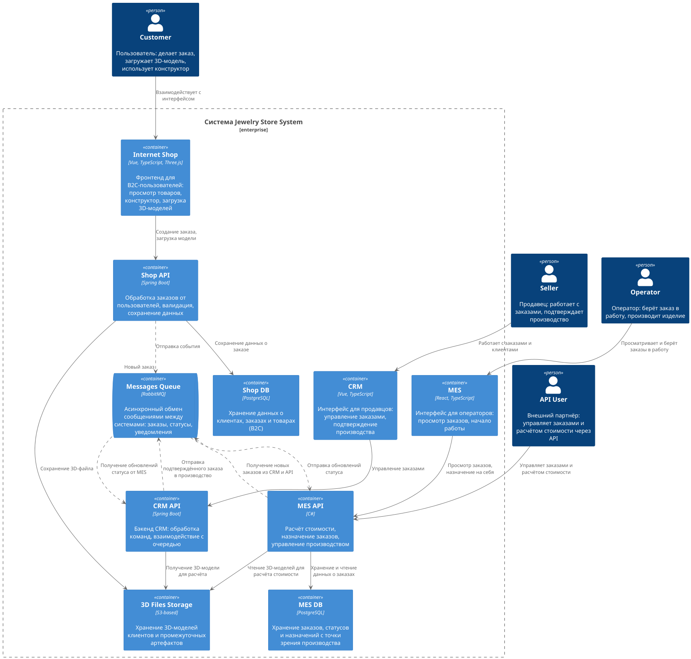

# Анализ и улучшение архитектуры системы «Александрит»

---
Диаграмма (C4-модель) «Александрит»:

[task1.puml](diagram/task1.puml)

## I. Идентификация проблемных мест

На основе анализа диаграммы (C4-модель), описания бизнеса, технологического стека и поступающих жалоб были выявлены следующие существующие и потенциальные проблемы:

1. **Медленный расчёт стоимости в MES**  
   Расчёт занимает от 2 до 30 минут в зависимости от сложности 3D-модели. Пользователи не видят прогресса, заказ «зависает», что вызывает недовольство клиентов и партнёров.

2. **Низкая производительность дашборда MES**  
   Операторы жалуются на долгую загрузку списка заказов, даже при наличии фильтрации и пагинации. Это замедляет начало работы и снижает мотивацию.

3. **Отсутствие масштабируемости**  
   Все приложения (MES API, CRM API, Shop API) работают в одном экземпляре. При росте нагрузки система теряет производительность, риск отказа высок.

4. **Потеря заказов и сообщений**  
   Клиенты и API-партнёры сообщают, что заказы «пропали». Это указывает на проблемы с надёжностью RabbitMQ или логикой обработки сообщений.

5. **Перегрузка от API-партнёров**  
   После открытия API система была завалена запросами. Отсутствуют механизмы ограничения трафика (rate limiting), что привело к сбоям и расторжению контрактов.

6. **Отсутствие мониторинга RabbitMQ**  
   Нет контроля за состоянием очередей, нет dead-letter queue (DLQ), retry-механизмов. Сбои в обработке сообщений остаются незамеченными.

7. **Непрозрачность статусов заказов**  
   Переходы между статусами происходят в разных системах (CRM, MES), а связь — через асинхронные сообщения. Менеджеры и клиенты не могут отследить текущее состояние заказа.

8. **Ручные релизы и тестирование**  
   Релизы откладываются из-за ручного E2E-тестирования и багов. Отсутствует автоматизация, что замедляет исправление критических проблем.

9. **Накопление старых заказов в MES DB**  
   Дашборд показывает все заказы, включая завершённые, что увеличивает нагрузку на БД и интерфейс.

10. **Отсутствие SLA и уведомлений**  
    Нет чётких сроков обработки заказов, пользователи не получают обратной связи. Это снижает доверие и удовлетворённость.

11. **Низкий уровень observability**  
    Отсутствуют APM-системы, централизованное логирование, трейсинг и алертинг. Команда узнаёт о проблемах только по жалобам пользователей.

12. **Неэффективное распределение заказов**  
    Операторы вручную выбирают заказы. Нет приоритезации по срочности или загруженности, что приводит к задержкам в начале производства.

## II. Список инициатив по устранению проблем

1. **Оптимизация SQL-запросов и добавление индексов в MES DB**  
   Ускорить загрузку дашборда оператора за счёт индексации по полям `status`, `created_at`, `assigned_to`.

2. **Архивация старых заказов**  
   Перенести завершённые заказы (старше 3 месяцев) в отдельную таблицу или хранилище, чтобы разгрузить основную БД.

3. **Перевод расчёта стоимости в асинхронный режим**  
   Заменить синхронный блокирующий расчёт на асинхронный с отображением статуса «в обработке», «рассчитано», «ошибка».

4. **Внедрение очереди задач для расчёта стоимости**  
   Использовать RabbitMQ или отдельный task-воркер для управления расчётами, с возможностью приоритезации и повторных попыток.

5. **Кеширование результатов расчёта по хешу 3D-модели**  
   Если модель уже встречалась, использовать закешированный результат, избегая повторных вычислений.

6. **Rate limiting и квоты для API-партнёров**  
   Ограничить количество запросов на клиента (например, 100 заказов/час), чтобы защитить систему от перегрузки.

7. **Внедрение dead-letter queue (DLQ) и retry-логики в RabbitMQ**  
   Обеспечить надёжность обработки сообщений: при ошибках — повторная отправка, при постоянных сбоях — отправка в DLQ для анализа.

8. **Масштабирование consumer-ов RabbitMQ**  
   Запускать несколько обработчиков сообщений, чтобы равномерно распределять нагрузку и ускорять обработку.

9. **Горизонтальное масштабирование ключевых сервисов (MES API, CRM API, Shop API)**  
   Развернуть несколько инстансов сервисов за балансировщиком нагрузки для повышения отказоустойчивости и производительности.

10. **Разделение БД на чтение и запись (Read/Write Splitting)**  
    Настроить репликацию PostgreSQL: мастер — для записи, реплики — для чтения (например, дашборды, отчёты).

11. **Внедрение CI/CD и автоматизации тестирования**  
    Настроить автоматическую сборку, unit- и интеграционные тесты, E2E-тесты, а также blue-green или canary-деплой.

12. **Автоназначение заказов операторам**  
    Реализовать логику распределения заказов по загруженности оператора и приоритету заказа.

13. **Внедрение observability (логи, метрики, трейсинг)**  
    Подключить APM-систему (например, Datadog или OpenTelemetry), централизованное логирование (ELK/Loki) и алертинг.

14. **SLA и статус-трекинг для клиентов и API-партнёров**  
    Внедрить механизм уведомлений (webhook или pull-статусы) и чёткие SLA: «расчёт — до 5 минут», «производство — до 3 недель».

15. **Виртуализация списков в интерфейсе MES**  
    Использовать lazy rendering для списков, чтобы не загружать все заказы сразу, а только видимые на экране.

---

## III. Приоритизация инициатив

Для приоритизации использовалась матрица **Вероятность × Влияние**, где учитывалась частота возникновения проблемы и её влияние на бизнес. На основе анализа, инициативы упорядочены по приоритету:

1. **Перевод расчёта стоимости в асинхронный режим**  
   Это корень всех проблем: синхронный расчёт блокирует систему, вызывает недовольство B2C и B2B-клиентов. Асинхронный подход с отображением статуса — ключ к прозрачности и производительности.

2. **Оптимизация SQL-запросов и добавление индексов в MES DB**  
   Прямое решение боли операторов. Медленный дашборд мешает им брать заказы, что напрямую влияет на доход. Реализуется быстро, эффект — мгновенный.

3. **Rate limiting и буферизация API-запросов**  
   После открытия API система была перегружена. Ограничение трафика — простое, но мощное решение, которое защитит систему от внешних сбоев и восстановит доверие партнёров.

4. **Внедрение DLQ и retry-логики в RabbitMQ**  
   Потеря сообщений — критическая угроза. DLQ позволит выявлять и анализировать «зависшие» заказы, а retry — автоматически повторять сбои.

5. **Кеширование результатов расчёта по хешу модели**  
   Снижает нагрузку на MES, ускоряет повторные расчёты. Особенно эффективно при росте числа типовых моделей.

6. **Архивация старых заказов**  
   Уменьшает объём данных в основной таблице, ускоряет работу БД и интерфейса. Простая, но важная оптимизация.

7. **Внедрение CI/CD и автоматизации тестов**  
   Позволяет быстрее выпускать исправления и снижает риск багов в продакшене. Среднесрочная инвестиция в стабильность.

8. **Горизонтальное масштабирование ключевых сервисов**  
   Необходимо для роста, но имеет смысл только после устранения узких мест в БД и расчётах.

9. **Внедрение observability (логи, метрики, трейсинг)**  
   Критично для долгосрочной поддержки, но эффект проявляется постепенно. Лучше внедрять после стабилизации системы.

10. **Автоназначение заказов операторам**  
    Повышает эффективность, но не решает критические проблемы. Реализуется после базовой стабильности.

---

## IV. Целевая архитектура через полгода

Через 6 месяцев система «Александрит» должна соответствовать следующим критериям:

1. **Производительность**
    - Расчёт стоимости — до 5 минут (асинхронно, с кешированием).
    - Дашборд MES — загружается за <1 секунду.
    - Интерфейс оператора — отзывчивый, с виртуализацией списков.

2. **Надёжность**
    - Нет потерь заказов благодаря DLQ и retry-логике.
    - RabbitMQ — кластерный, с мониторингом и масштабируемыми consumer-ами.

3. **Масштабируемость**
    - Все ключевые сервисы (MES API, CRM API, Shop API) — масштабируются горизонтально.
    - БД настроена с репликацией (read/write splitting).

4. **Прозрачность**
    - Пользователи видят статус заказа в реальном времени.
    - API-партнёры получают уведомления и соблюдают SLA.

5. **DevOps и доставка**
    - CI/CD настроен, релизы — каждые 1–2 недели.
    - Тесты автоматизированы, деплой — безопасный (blue-green/canary).

6. **Управление нагрузкой**
    - Rate limiting защищает от перегрузки.
    - Входящие API-запросы буферизуются и приоритизируются.

---

## V. ТОП-3 инициативы на ближайшие 6 месяцев

Если бы можно было реализовать **только три** инициативы, я бы выбрал:

1. **Перевод расчёта стоимости в асинхронный режим с отображением прогресса**  
   Это **самая критичная проблема**. Долгий синхронный расчёт блокирует заказы, вызывает недовольство всех пользователей. Асинхронный подход с прогресс-баром (через polling или WebSocket) мгновенно улучшит UX и снизит нагрузку на систему.

2. **Оптимизация SQL-запросов и добавление индексов в MES DB**  
   Операторы — ключевые сотрудники, от них зависит начало производства. Медленный дашборд снижает их эффективность и мотивацию. Оптимизация запросов и индексов — быстрое и эффективное решение, которое даст результат уже через несколько дней.

3. **Rate limiting и буферизация входящих API-запросов**  
   После открытия API система была завалена запросами, что привело к сбоям и потере контрактов. Ограничение трафика (например, через API Gateway) защитит систему, обеспечит предсказуемость и восстановит доверие партнёров.

---

## Заключение

Предложенные инициативы направлены на **немедленное устранение критических узких мест**, влияющих на **удовлетворённость клиентов**, **производительность операторов** и **стабильность системы**.

Три выбранных пункта:
- устраняют **главные боли** пользователей и сотрудников,
- реализуемы **за 1–2 месяца**,
- дают **быстрый и ощутимый бизнес-эффект**.

После их внедрения можно переходить к **стратегическим инициативам**: масштабированию, микросервисам, полной observability и CI/CD.