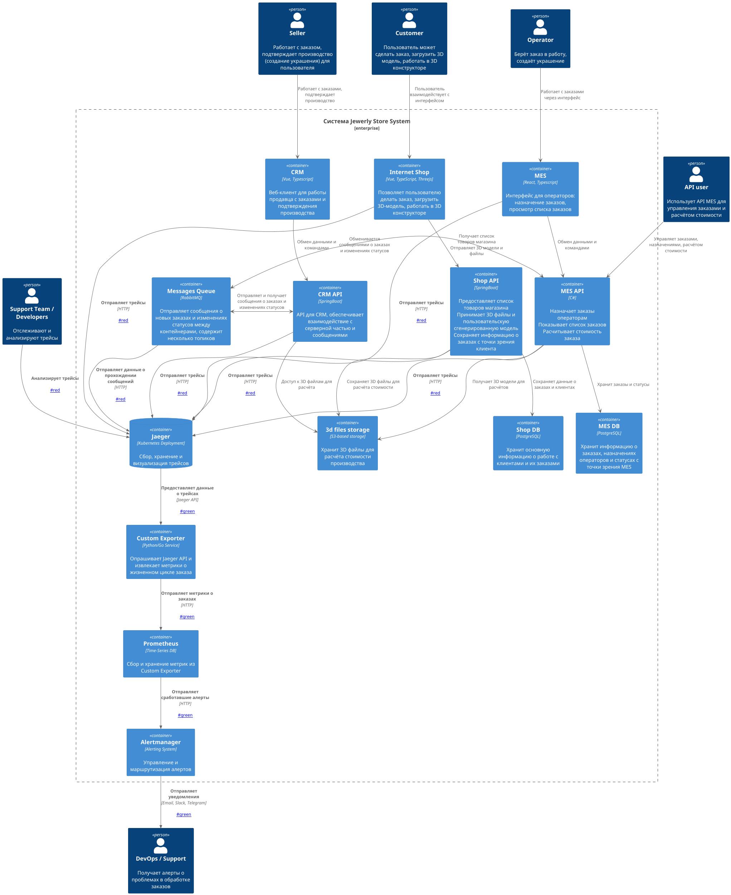
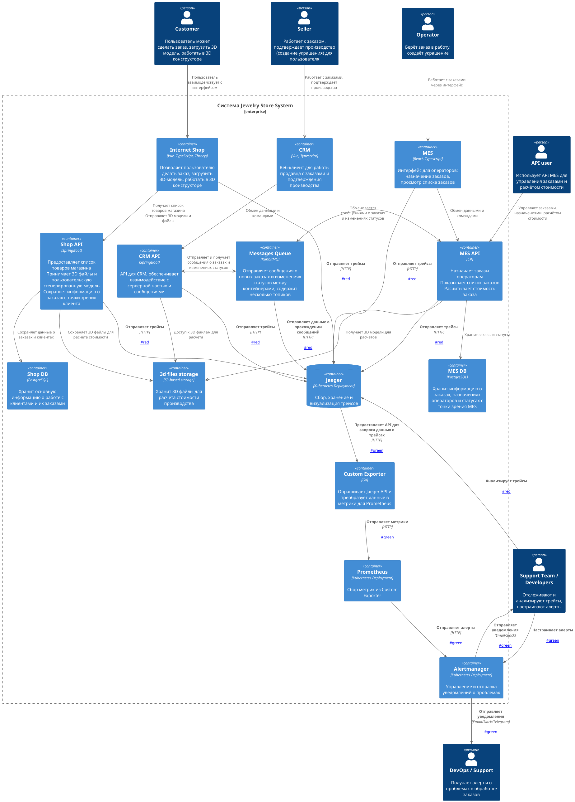

# Архитектурное решение по трейсингу

---

## Мотивация

На текущий момент в системе «Александрит» отсутствует сквозная видимость жизненного цикла заказа. Команда сталкивается с ситуацией, когда заказы:
- «зависают» без видимых причин,
- теряются между сервисами,
- не обрабатываются вовремя, хотя клиенты и партнёры уверены, что отправили их.

Это приводит к:
- **Росту числа жалоб** от клиентов и API-партнёров,
- **Потере доверия** и расторжению контрактов,
- **Увеличению нагрузки на поддержку**, которая тратит время на ручной поиск статусов,
- **Замедлению диагностики** инцидентов — инженеры не могут быстро определить, где именно произошёл сбой.

Внедрение трейсинга позволит получить **сквозную видимость** прохождения заказа от момента создания до завершения производства. Это даст возможность:
- Быстро находить узкие места и сбои,
- Обеспечить прозрачность для клиентов и партнёров,
- Автоматизировать мониторинг и алертинг,
- Улучшить качество обслуживания и выполнение SLA.

### Бизнес- и технические метрики, которые улучшит трейсинг

1. **Среднее время разрешения инцидентов (MTTR)**  
   Трейсинг сократит время диагностики, позволяя быстро находить источник проблемы.

2. **Количество потерянных заказов в месяц**  
   Система сможет выявлять «зависшие» заказы и предотвращать их потерю.

3. **Среднее время обработки заказа (от SUBMITTED до SHIPPED)**  
   Анализ трейсов поможет выявить узкие места и оптимизировать процессы.

4. **Уровень удовлетворённости клиентов (NPS)**  
   Прозрачность статусов и сокращение задержек повысят доверие к бренду.

5. **Количество обращений в поддержку по статусу заказа**  
   Снижение нагрузки на поддержку за счёт автоматического отслеживания и уведомлений.

---

## Анализ системы: где заказ может «сломаться» или зависнуть

Ниже перечислены ключевые этапы жизненного цикла заказа и потенциальные точки сбоев:

1. **`INITIATED` → `SUBMITTED` (Онлайн-магазин)**
    - Потеря данных корзины, ошибка на UI, сбой в Shop API.

2. **`SUBMITTED` → `PRICE_CALCULATED` (MES)**
    - Сообщение не доходит до RabbitMQ, потеряно при обработке, попадает в DLQ.

3. **`PRICE_CALCULATED` → `MANUFACTURING_APPROVED` (CRM)**
    - Заказ не отображается в CRM, не подтверждается продавцом из-за задержки.

4. **`MANUFACTURING_APPROVED` → `MANUFACTURING_STARTED` (MES)**
    - Оператор не видит заказ — дашборд тормозит, фильтр не работает, нет уведомлений.

5. **`MANUFACTURING_STARTED` → `COMPLETED` (MES)**
    - Ошибка в производстве, отсутствие обновления статуса, сбой при отправке в очередь.

6. **Обработка 3D-модели (S3 Storage)**
    - Модель не загружается, повреждена, слишком большая, не читается MES.

7. **Передача сообщений через RabbitMQ**
    - Сообщение потеряно, не подтверждено, потребитель упал, нет retry-логики.

8. **API-партнёрский заказ (внешний источник)**
    - Некорректный формат, отсутствие `order_id`, ошибка авторизации.

---

## Список данных, которые должны попадать в трейсинг

Для каждого этапа обработки заказа необходимо собирать следующие данные:

1. **`trace_id`** — уникальный идентификатор трейса, общий для всего жизненного цикла заказа.
2. **`span_id`** — идентификатор текущего шага (например, расчёт стоимости, подтверждение).
3. **`order_id`** — идентификатор заказа.
4. **`status`** — текущий статус заказа (например, `submitted`, `calculating`, `in_progress`).
5. **`service.name`** — имя сервиса, обрабатывающего шаг (например, `shop-api`, `mes-api`).
6. **`timestamp`** — время начала и завершения операции.
7. **`duration`** — продолжительность обработки на этапе.
8. **`customer_id`** — идентификатор клиента.
9. **`user_id`** — ID продавца или оператора, работающего с заказом.
10. **`3d_model_size` и `polygon_count`** — размер и сложность 3D-модели.
11. **`calculation_time`** — время, затраченное на расчёт стоимости.
12. **`source`** — источник заказа (`b2c`, `api`).
13. **`error.message` и `error.type`** — описание ошибки, если она произошла.
14. **`logs`** — связанные логи с уровнем `error` или `warning`.

---

## Предлагаемое решение

Для реализации трейсинга предлагается использовать **OpenTelemetry** в качестве стандарта сбора данных и **Jaeger** как систему визуализации, хранения и анализа трейсов.

### Технологии

1. **OpenTelemetry SDK**  
   Будет внедрён в backend-сервисы (Java, C#, JavaScript) для автоматического и ручного инструментирования.

2. **Jaeger**  
   Будет использован как центральный сборщик и визуализатор трейсов. Поддерживает OTLP, имеет мощный UI и API.

3. **OTLP (OpenTelemetry Protocol)**  
   Протокол передачи данных между сервисами и Jaeger Collector.

4. **Jaeger Agent**  
   Развертывается на каждом хосте для буферизации и отправки трейсов.

5. **RabbitMQ Tracer Plugin**  
   Плагин для отслеживания прохождения сообщений между сервисами.

---

### Компоненты, подлежащие доработке

1. **Internet Shop (Vue + Spring Boot)**
    - Внедрить OpenTelemetry SDK в Spring Boot (backend).
    - Добавить JS SDK в Vue-фронтенд для трейсов на клиенте.

2. **Shop API (Spring Boot)**
    - Настроить автоматическое инструментирование через Java Agent.

3. **CRM API (Spring Boot)**
    - Аналогично Shop API — автоматическое инструментирование.

4. **MES API (C#)**
    - Внедрить OpenTelemetry .NET SDK с ручным созданием спанов для расчёта стоимости.

5. **MES (React)**
    - Добавить OpenTelemetry JS SDK для отслеживания действий оператора.

6. **RabbitMQ**
    - Установить и настроить плагин для трейсинга сообщений.

7. **3D Storage (S3)**
    - Обернуть S3-клиент в middleware с трейсами при загрузке/выгрузке моделей.

---

### Новые компоненты и связи

1. **Jaeger Agent** — разворачивается на каждом сервере.
2. **Jaeger Collector** — принимает трейсы от агентов.
3. **Jaeger Query** — предоставляет UI для просмотра трейсов.
4. **Custom Exporter** — сервис, преобразующий трейсы в метрики для Prometheus.

### Новые связи (выделены красным на схеме)

1. **Каждый сервис → Jaeger Agent** — отправка трейсов.
2. **Jaeger Agent → Jaeger Collector** — передача данных.
3. **Jaeger Collector → Jaeger Query** — хранение и визуализация.
4. **RabbitMQ → Jaeger Agent** — трейсинг сообщений.
5. **Custom Exporter ← Jaeger API** — опрос трейсов.
6. **Custom Exporter → Prometheus** — отправка метрик.

> 🔗 **Ссылка на диаграмму с трейсингом (красные элементы)**:  
> 

[task3_tracing.puml](diagram/task3_tracing.puml)

---

## Дополнительное задание: Автоматический мониторинг и алертинг

На основе данных трейсинга будет реализована система автоматического мониторинга и алертинга.

### Реализация

1. **Custom Exporter**
    - Периодически опрашивает Jaeger API.
    - Анализирует трейсы и извлекает ключевые метрики:
        - Среднее время на каждом этапе.
        - Количество заказов в каждом статусе.
        - Количество «зависших» заказов (превысили порог времени).
        - Количество ошибок на этапе.

2. **Prometheus**
    - Собирает метрики с Custom Exporter.
    - Хранит данные для анализа и визуализации.

3. **Grafana**
    - Строит дашборды по метрикам из Prometheus.
    - Отображает время обработки, количество ошибок, статусы заказов.

4. **Alertmanager**
    - Получает алерты от Prometheus.
    - Отправляет уведомления в Slack, Telegram, Email.

### Алерты

1. **Заказ завис на этапе > 15 минут**
    - Условие: `order_stage_duration_seconds > 900`
    - Действие: отправка в Slack DevOps.

2. **Статус `PRICE_CALCULATED` не менялся > 10 минут**
    - Условие: `order_status_count{status="PRICE_CALCULATED"} unchanged`
    - Действие: email DevOps.

3. **Заказ в статусе `MANUFACTURING_STARTED` > 2 часа**
    - Условие: `order_duration_in_status > 7200`
    - Действие: создание тикета в Jira.

4. **Потеря сообщений в RabbitMQ**
    - Условие: `rabbitmq_messages_unacknowledged > 100`
    - Действие: алерт в Telegram.

> 🔗 **Ссылка на диаграмму с мониторингом и алертингом (зелёные элементы)**:  
> > 

[task3_tracing_monitor_alert.puml](diagram/task3_tracing_monitor_alert.puml)

---

## Компромиссы

1. **Высокая стоимость внедрения и сопровождения**  
   Требуется изменение всех backend-приложений, настройка инфраструктуры Jaeger, безопасность, мониторинг самого трейсинга.

2. **Влияние на производительность**  
   Сбор трейсов создаёт накладные расходы. Решение — использование sampling (например, 10% запросов).

3. **Сложность интеграции с устаревшим кодом**  
   Если в системе есть legacy-компоненты, поддержка OpenTelemetry может быть ограничена.

4. **Ограничения 3rd-party систем**  
   Интеграция с внешними системами (например, платежными шлюзами) может быть невозможна без их поддержки OpenTelemetry.

5. **Сложность трейсинга S3-хранилища**  
   Требуется обёртка вокруг S3-клиента, что усложняет реализацию.

---

## Аспекты безопасности

1. **Аутентификация и авторизация**  
   Доступ к Jaeger UI разрешён только для сотрудников с ролями **Поддержка**, **DevOps**, **Разработчик**.  
   Настроена аутентификация через корпоративный Identity Provider (например, Keycloak, OAuth/SAML).

2. **Ограничение внешнего доступа**  
   Интерфейс трейсинга доступен только из внутренней сети или через VPN.

3. **Скрытие чувствительных данных**  
   Поля с персональной информацией (например, `customer_id`, `user_id`) заменяются на заглушки или шифруются.

4. **Шифрование трафика**  
   Весь трафик между сервисами, агентами и Jaeger передаётся по **HTTPS/TLS 1.2+**.

5. **Ограничение хранения данных**  
   Трейсы хранятся не более 30 дней. Настройка TTL в Jaeger.

6. **Мониторинг самой системы трейсинга**  
   Jaeger и Custom Exporter мониторятся через Prometheus и Alertmanager.

---

## Заключение

Внедрение трейсинга на базе OpenTelemetry и Jaeger даст компании «Александрит» полную прозрачность в обработке заказов. Это позволит:
- Быстро выявлять и устранять сбои,
- Сократить время на диагностику,
- Повысить доверие клиентов и партнёров,
- Автоматизировать мониторинг и алертинг.

Решение масштабируемо, соответствует современным стандартам и может быть расширено в будущем. Несмотря на компромиссы, долгосрочная выгода от внедрения значительно превышает затраты.