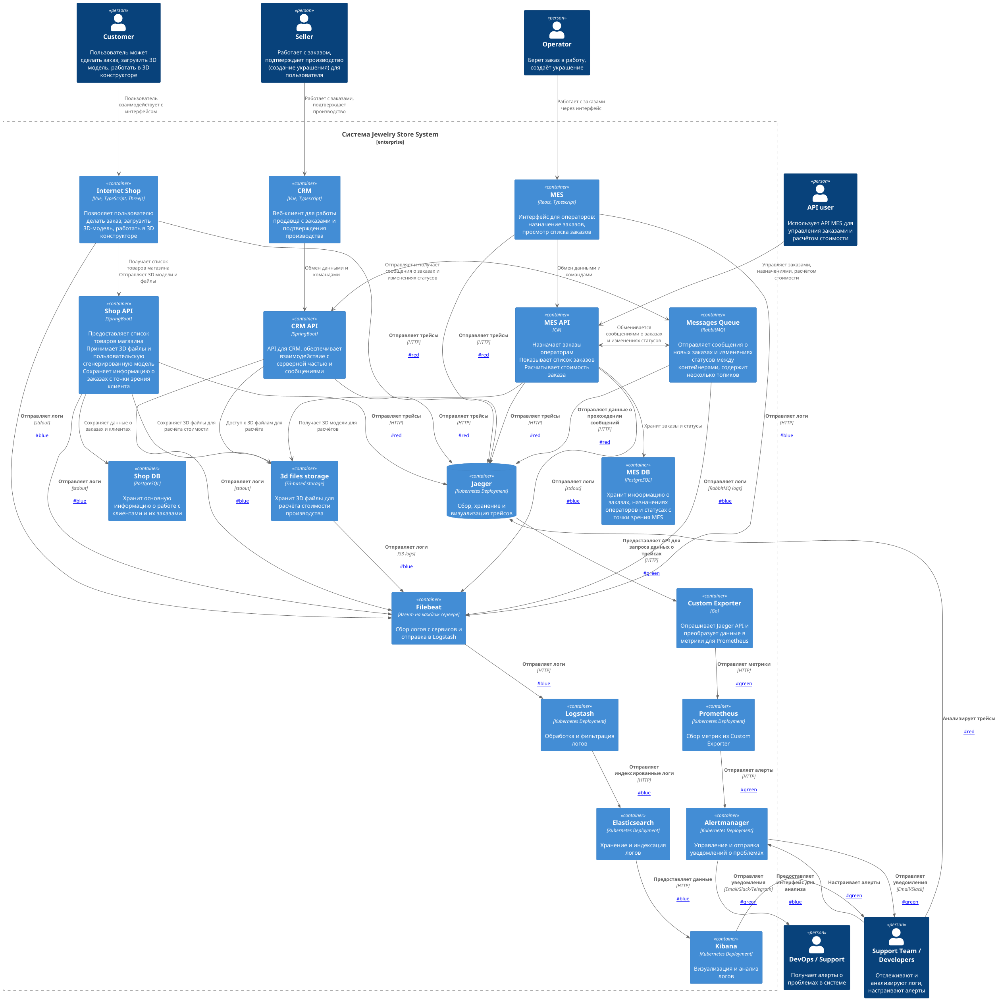

# Архитектурное решение по логированию

---

## Мотивация

На текущий момент команда «Александрит» сталкивается с серьёзной проблемой: **диагностика инцидентов происходит по описаниям клиентов**, а не по объективным данным. Это приводит к:
- Длительным расследованиям, когда невозможно воспроизвести последовательность событий.
- Высокой нагрузке на поддержку и разработчиков.
- Задержкам в устранении сбоев и росту числа просроченных заказов.

Внедрение централизованного логирования решит эти проблемы и даст компании следующие преимущества:

1. **Ускорение диагностики инцидентов**  
   Команда сможет быстро находить и анализировать ошибки, не полагаясь на рассказы клиентов.

2. **Прозрачность бизнес-процессов**  
   Будет возможность отслеживать весь путь заказа — от создания до производства.

3. **Возможность аудита и контроля**  
   Логи позволят фиксировать действия пользователей, операторов и систем, что важно для безопасности и подотчётности.

4. **Превентивный мониторинг и алертинг**  
   На основе логов можно выявлять аномалии, такие как DDoS, ошибки валидации или сбои в интеграциях.

5. **Оптимизация производительности**  
   Анализ логов поможет выявить узкие места в системе, например, медленные запросы к БД или зависшие обработчики.

### Бизнес- и технические метрики, которые улучшит логирование

1. **Среднее время разрешения инцидента (MTTR)**  
   Снижение за счёт быстрого доступа к контексту ошибки.

2. **Количество обращений в поддержку по статусу заказа**  
   Снижение за счёт автоматического отображения статусов и уведомлений.

3. **Число потерянных заказов в месяц**  
   Логи помогут выявлять и предотвращать потерю сообщений между сервисами.

4. **Время, затраченное разработчиками на поиск причин сбоев**  
   Сокращение за счёт централизованного доступа к логам.

5. **Уровень удовлетворённости клиентов (NPS)**  
   Повышение за счёт быстрого реагирования и прозрачности.

---

## Анализ системы: какие логи нужно собирать и откуда

Ниже перечислены системы, из которых необходимо собирать логи, и ключевые события, подлежащие логированию.

### Системы для сбора логов

1. **Internet Shop (Vue + Spring Boot)**
    - Основная точка входа для B2C-клиентов.
    - Критично для выручки и UX.

2. **Shop API (Spring Boot)**
    - Ядро интернет-магазина.
    - Обрабатывает заказы, взаимодействует с БД и очередями.

3. **CRM (Vue + CRM API)**
    - Управление заказами, подтверждение производства.
    - Ошибки здесь влияют на бизнес-процессы.

4. **MES API и MES (C#, React)**
    - Расчёт стоимости, назначение заказов, производство.
    - Высокая нагрузка и сложные вычисления.

5. **RabbitMQ**
    - Центральный компонент интеграции.
    - Потеря сообщений — критическая угроза.

6. **3D Files Storage (S3-based)**
    - Загрузка и хранение 3D-моделей.
    - Проблемы с доступом к файлам — частая причина сбоев.

---

## Список необходимых логов (уровень INFO)

1. **Создание заказа**
    - Поля: `timestamp`, `user_id`, `order_id`, `source` (`b2c`, `api`), `3d_model_hash`, `total_sum`

2. **Изменение статуса заказа**
    - Поля: `timestamp`, `order_id`, `from_status`, `to_status`, `user_id` (оператор/продавец), `service`

3. **Загрузка 3D-модели**
    - Поля: `timestamp`, `order_id`, `file_size`, `polygon_count`, `user_id`, `upload_duration`

4. **Начало расчёта стоимости**
    - Поля: `timestamp`, `order_id`, `model_complexity`, `started_by_service`, `queue_position`

5. **Завершение расчёта стоимости**
    - Поля: `timestamp`, `order_id`, `calculation_duration`, `result_status` (`success`, `error`), `cost`

6. **Подтверждение производства (CRM)**
    - Поля: `timestamp`, `order_id`, `seller_id`, `action` (`approved`, `rejected`)

7. **Назначение заказа оператору**
    - Поля: `timestamp`, `order_id`, `operator_id`, `assigned_by` (`manual`, `auto`)

8. **Отправка сообщения в RabbitMQ**
    - Поля: `timestamp`, `message_id`, `exchange`, `routing_key`, `payload_size`, `source_service`

9. **Получение сообщения из RabbitMQ**
    - Поля: `timestamp`, `message_id`, `queue`, `consumer_service`, `processing_duration`

10. **Обращение к 3D Storage (S3)**
    - Поля: `timestamp`, `operation` (`upload`, `download`), `file_key`, `duration`, `status`

---

## Использование других уровней логирования

Да, помимо `INFO`, будут использоваться следующие уровни:

1. **`ERROR`**
    - Для ошибок, приводящих к сбою операции (например, ошибка подключения к БД, отказ расчёта).
    - Требует алертинга.

2. **`WARN`**
    - Для предупреждений (например, превышение размера модели, rate limit, медленный запрос).
    - Не требует немедленного вмешательства, но подлежит мониторингу.

3. **`DEBUG`**
    - Для детальной отладки (например, тело запроса, SQL-запросы, внутренние состояния).
    - Включается только в dev-среде или временно при расследовании инцидента.

4. **`FATAL`**
    - Для критических сбоев, приводящих к остановке сервиса (например, нехватка памяти, ошибка старта приложения).
    - Требует немедленного вмешательства.

---

## Приоритезация внедрения логирования и трейсинга

Поскольку внедрение невозможно одновременно для всех систем, приоритеты расставляются по бизнес-критичности и частоте инцидентов.

1. **Shop API**
    - **Почему в приоритете**: основная точка входа клиентов. Ошибки здесь напрямую влияют на выручку и UX.
    - **Что внедряем**: сначала логирование, затем трейсинг.

2. **CRM и CRM API**
    - **Почему в приоритете**: отвечает за маршрутизацию заказов. Ошибки не всегда видны клиенту, но блокируют производство.
    - **Что внедряем**: логирование, затем трейсинг (для связи shop → crm).

3. **RabbitMQ**
    - **Почему в приоритете**: потеря сообщений — основная причина "зависших" заказов.
    - **Что внедряем**: логирование сообщений (send/receive), DLQ.

4. **MES API**
    - **Почему в приоритете**: ключевой сервис для расчёта и производства.
    - **Что внедряем**: логирование, трейсинг можно отложить.

5. **Internet Shop (фронтенд)**
    - **Почему в приоритете**: ошибки на клиенте (например, не отправлен заказ) часто не доходят до сервера.
    - **Что внедряем**: логирование ключевых действий через бэкенд.

6. **3D Files Storage**
    - **Почему в приоритете**: сбои при загрузке/чтении моделей — частая причина ошибок в MES.
    - **Что внедряем**: логирование операций доступа.

---

## Предлагаемое решение

Для реализации логирования предлагается использовать **ELK-стек** (Elasticsearch, Logstash, Kibana) как проверенное, масштабируемое и гибкое решение.

### Компоненты системы логирования

1. **Filebeat / Metricbeat**
    - Легковесные агенты, устанавливаются на каждый сервер.
    - Собирают логи из файлов и stdout, отправляют в Logstash.

2. **Logstash**
    - Принимает логи, парсит, фильтрует, анонимизирует чувствительные данные, обогащает (например, добавляет `service.name`).
    - Отправляет в Elasticsearch.

3. **Elasticsearch**
    - Хранилище логов. Поддерживает полнотекстовый поиск, агрегации, масштабирование.

4. **Kibana**
    - Веб-интерфейс для поиска, анализа и визуализации логов.
    - Настройка дашбордов, алертов, прав доступа.

### Что нужно внедрить или доработать

1. **Каждый сервис (Shop API, CRM API, MES API, Internet Shop)**
    - Настроить логирование в stdout в формате JSON с необходимыми полями.

2. **Filebeat**
    - Установить на каждый сервер, настроить отправку логов в Logstash.

3. **Logstash**
    - Настроить фильтры для парсинга, анонимизации, добавления метаданных.

4. **Elasticsearch**
    - Развернуть кластер, настроить индексы, политики хранения, репликацию.

5. **Kibana**
    - Настроить дашборды, роли доступа, алерты.

### Новые связи на C4-диаграмме

1. **Каждый сервис → Filebeat** — отправка логов.
2. **Filebeat → Logstash** — передача логов.
3. **Logstash → Elasticsearch** — индексация.
4. **Elasticsearch → Kibana** — визуализация.
5. **Kibana → Support Team / Developers** — доступ к анализу.

> 🔗 **Ссылка на обновлённую C4-диаграмму с логированием**:  

[task4.puml](diagram/task4.puml)

---

## Политика безопасности в отношении логов

1. **Аутентификация и авторизация**
    - Доступ к Kibana только для сотрудников с ролями: "Поддержка", "Разработчик", "DevOps", "Безопасность".
    - Настроена через SSO (например, Keycloak).

2. **Шифрование**
    - Все данные передаются по HTTPS между компонентами.
    - Данные в Elasticsearch шифруются на уровне диска.

3. **Работа с чувствительными данными**
    - Запрещено логировать пароли, номера карт, персональные данные.
    - Logstash фильтрует и маскирует поля: `user_id`, `email`, `phone` (например, `user_***`).
    - В логах используется `customer_hash` вместо `customer_id`.

4. **Аудит доступа к логам**
    - Все действия в Kibana (поиск, экспорт, изменение ролей) логируются.

---

## Политика хранения логов

1. **Индексы**
    - Отдельный индекс для каждой системы: `logs-shop-api`, `logs-crm`, `logs-mes`, `logs-rabbitmq`.

2. **Срок хранения**
    - Оперативный анализ: 30 дней.
    - Анализ инцидентов: 90 дней.
    - Аудит: 1 год (архив в холодном хранилище).

3. **Размер и ротация**
    - Максимальный размер индекса — 50 ГБ.
    - Ротация по времени (ежедневно) и размеру.
    - Используется ILM (Index Lifecycle Management) в Elasticsearch.

---

## Превращение системы сбора логов в систему анализа

### 1. Алертинг
Настроить автоматические уведомления при:
- Росте ошибок 5xx более чем на 10% за 5 минут.
- Появлении сообщений с уровнем `FATAL`.
- Превышении времени расчёта стоимости (например, > 300 сек).
- Появлении сообщений в DLQ.

### 2. Поиск аномалий
Использовать машинное обучение (через Elastic ML) для обнаружения:
- DDoS-атак (резкий рост RPS).
- Подозрительной активности (например, 1000 заказов от одного клиента за минуту).
- Необычного поведения сервисов (например, рост ошибок в определённый час).

### 3. Дашборды в Kibana
Создать:
- Дашборд "Жизненный цикл заказа" — от `SUBMITTED` до `SHIPPED`.
- Дашборд "Ошибки по сервисам" — количество ошибок 5xx.
- Дашборд "Производительность расчёта" — время по квантилям.
- Дашборд "Очереди и сообщения" — статусы RabbitMQ.

---

## Дополнительное задание: Критерии выбора технологии для логов

1. **Лицензия и стоимость**
    - ELK: Elastic License (бесплатно, но с ограничениями в новых версиях).
    - OpenSearch: Apache 2.0 (полностью open-source).
    - Splunk: проприетарная, очень дорогая.
    - **Победитель**: OpenSearch (свободная лицензия).

2. **Масштабируемость и производительность**
    - ELK и OpenSearch поддерживают горизонтальное масштабирование.
    - Splunk требует мощных ресурсов.
    - **Победитель**: ELK/OpenSearch.

3. **Гибкость и кастомизация**
    - ELK/OpenSearch: полный контроль над фильтрами, парсингом, политиками.
    - Splunk: мощный, но сложный язык поиска.
    - **Победитель**: ELK/OpenSearch.

4. **Интеграции и экосистема**
    - ELK: Beats, APM, Uptime, Machine Learning.
    - OpenSearch: аналогичные инструменты, но младше.
    - Splunk: огромная экосистема, но платная.
    - **Победитель**: ELK.

5. **Простота развертывания и поддержки**
    - ELK: сложное управление, требует DevOps-экспертизы.
    - OpenSearch: чуть проще, AWS-оптимизирован.
    - Splunk: прост в использовании, но дорог.
    - **Победитель**: ELK (при наличии команды).

> **Итоговый выбор**: **ELK-стек** — оптимальное решение по соотношению функциональности, стоимости и зрелости экосистемы.

---

## Заключение

Внедрение централизованного логирования на базе ELK-стека даст компании «Александрит» мощный инструмент для диагностики, мониторинга и оптимизации.  
Решение масштабируемо, безопасно и позволяет переходить от реактивной поддержки к проактивному управлению системой.  
Сбор логов из ключевых сервисов и настройка алертинга сократят время простоя, повысят доверие клиентов и обеспечат устойчивый рост бизнеса.