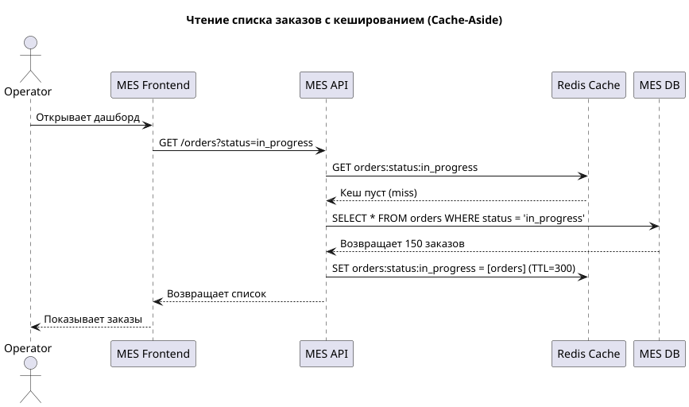
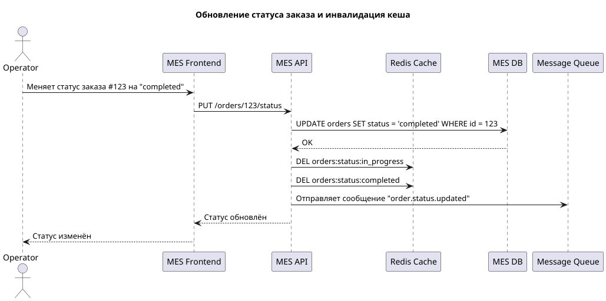

# Архитектурное решение по кешированию

---

## Мотивация

Система «Александрит» сталкивается с двумя критическими проблемами:
- **Операторы жалуются на медленную загрузку списка заказов в MES** — дашборд тормозит, несмотря на фильтрацию и пагинацию.
- **Клиенты недовольны скоростью выполнения заказа** — особенно при повторных расчётах стоимости.

Анализ показывает, что эти проблемы во многом вызваны **избыточными запросами к базе данных и повторными вычислениями**. Например:
- Операторы каждый раз загружают список заказов, хотя данные меняются не так часто.
- Одинаковые 3D-модели (например, типовые кольца) каждый раз проходят полный расчёт стоимости, хотя результат можно закешировать.

Внедрение кеширования решит эти проблемы и принесёт следующие выгоды:

1. **Ускорение загрузки дашборда MES**  
   Операторы смогут быстрее видеть новые заказы, что напрямую влияет на их мотивацию и производительность.

2. **Снижение нагрузки на MES DB**  
   Кеширование снизит количество запросов к БД, что улучшит общую стабильность системы.

3. **Ускорение расчёта стоимости для типовых моделей**  
   Повторные расчёты будут выполняться мгновенно за счёт кеша.

4. **Повышение удовлетворённости клиентов**  
   Сокращение времени ожидания при расчёте и подтверждении заказа.

5. **Оптимизация использования ресурсов**  
   Снижение CPU-нагрузки на MES API за счёт уменьшения количества повторных вычислений.

### Элементы системы, которые имеет смысл закешировать

1. **Список заказов в MES (с фильтрами по статусу)**
    - Часто запрашивается, редко меняется (только при обновлении статуса).

2. **Результаты расчёта стоимости для 3D-моделей**
    - Высокая стоимость вычисления, повторяемость моделей.

3. **Список доступных элементов в 3D-конструкторе**
    - Редко меняется, часто запрашивается.

4. **Справочники (металлы, пробы, размеры)**
    - Статические данные, используются в расчётах.

5. **Статусы заказов и их цепочки**
    - Неизменяемые бизнес-правила.

---

## Предлагаемое решение

### Тип кеширования: серверное

Будет использоваться **серверное кеширование** на уровне бэкенда (MES API и Shop API), а не клиентское, по следующим причинам:
- Клиентское кеширование (например, в браузере) не подходит для внутренних сервисов (CRM, MES).
- Данные должны быть согласованы между всеми операторами — кеш должен быть централизованным.
- Клиенты (особенно API-партнёры) могут обходить кеш, что снижает его эффективность.

### Паттерн кеширования: Cache-Aside

Для всех критических данных будет использован паттерн **Cache-Aside** (также известный как Lazy Loading).

#### Почему Cache-Aside?

1. **Гибкость** — данные загружаются в кеш только при первом запросе.
2. **Эффективность** — не тратится время на предзагрузку неиспользуемых данных.
3. **Простота реализации** — легко интегрируется в существующий код.
4. **Контроль над инвалидацией** — кеш можно очищать по ключу при обновлении данных.

#### Почему не другие паттерны?

1. **Write-Through**
    - Данные пишутся одновременно в кеш и БД.
    - Не подходит, потому что:
        - Увеличивает задержку операций записи.
        - Нет необходимости всегда хранить данные в кеше (например, редко используемые заказы).

2. **Refresh-Ahead (как в Redis with TTL + фоновое обновление)**
    - Данные предварительно обновляются до истечения TTL.
    - Сложен в реализации, избыточен для текущих задач.
    - Подходит для данных с предсказуемым доступом, а не для динамических заказов.

---

### Стратегия инвалидации кеша

Будет использоваться **комбинированная стратегия инвалидации**:

1. **По ключу (программная)**
    - При изменении статуса заказа — удаляется кеш по ключу `orders:status:{status}`.
    - При обновлении расчёта — удаляется кеш по ключу `cost:calculation:{model_hash}`.

2. **По времени (TTL)**
    - Для данных, которые редко обновляются (справочники), устанавливается TTL 24 часа.
    - Для списка заказов — TTL 5 минут.

3. **При запуске сервиса**
    - Полная очистка кеша при деплое (опционально, по флагу).

#### Почему не другие стратегии?

1. **Только по времени (TTL)**
    - Риск показа устаревших данных до истечения TTL.
    - Не подходит для заказов, где важна актуальность.

2. **Инвалидация по шаблону (wildcard)**
    - Операции вроде `DEL orders:*` могут быть медленными и блокирующими.
    - Используется только в экстренных случаях (например, миграция).

3. **Нет инвалидации**
    - Приведёт к рассогласованности данных — недопустимо.

---

### Диаграмма последовательности: кеширование списка заказов
 

[task5_order_cache.puml](diagram/task5_order_cache.puml)

### Диаграмма последовательности: обновление статуса заказа

[task5_update_order.puml](diagram/task5_update_order.puml)

---

## Дополнительное задание: Сравнение решений

### Решение 1: Кеширование на уровне API с Redis (Cache-Aside)

1. **Описание**
    - Внедрение Redis как централизованного кеша.
    - Кеширование списка заказов, результатов расчёта, справочников.
    - Паттерн: Cache-Aside.
    - Инвалидация: по ключу + TTL.

2. **Плюсы**
    - Высокая производительность (Redis в памяти).
    - Поддержка TTL, pub/sub, кластеризации.
    - Легко масштабируется.
    - Хорошо интегрируется с Spring Boot и C#.

3. **Минусы**
    - Требует отдельного инфраструктурного компонента.
    - Риск потери данных при сбое (если не настроена персистентность).
    - Нужно следить за размером кеша.

---

### Решение 2: Кеширование на уровне БД (PostgreSQL + Materialized Views)

1. **Описание**
    - Использование материализованных представлений для часто запрашиваемых данных.
    - Обновление по расписанию (например, каждые 5 минут).
    - Нет внешнего кеша — всё в БД.

2. **Плюсы**
    - Не требует новых сервисов.
    - Данные согласованы с БД.
    - Подходит для отчётов и аналитики.

3. **Минусы**
    - Медленнее, чем Redis.
    - Ограниченная гибкость (не подходит для динамических запросов).
    - Нет гранулярной инвалидации.
    - Не подходит для кеширования расчётов.

---

### Заключение: Какое решение лучше?

**Выбираем Решение 1 (Redis + Cache-Aside)**, потому что:
1. Оно **наилучшим образом решает обе задачи** — ускорение дашборда и ускорение расчётов.
2. Обеспечивает **высокую производительность** за счёт работы в памяти.
3. Позволяет **гибко управлять инвалидацией** по ключу.
4. Поддерживает **масштабирование** при росте нагрузки.
5. Совместимо с **разными технологиями** (Java, C#, React).
6. Является **стандартом для кеширования в микросервисных архитектурах**.

Решение 2 (Materialized Views) можно рассмотреть позже для аналитических запросов, но оно не подходит для оперативного кеширования.

---

## Заключение

Внедрение серверного кеширования на базе Redis по паттерну Cache-Aside — оптимальное решение для текущих проблем «Александрита».  
Оно ускорит работу операторов, снизит нагрузку на MES DB, уменьшит время расчёта стоимости и повысит удовлетворённость клиентов.  
Комбинированная стратегия инвалидации (по ключу + TTL) обеспечит баланс между производительностью и актуальностью данных.

Решение масштабируемо, безопасно и легко интегрируется в существующую архитектуру.